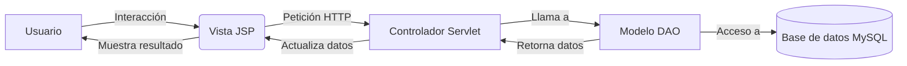
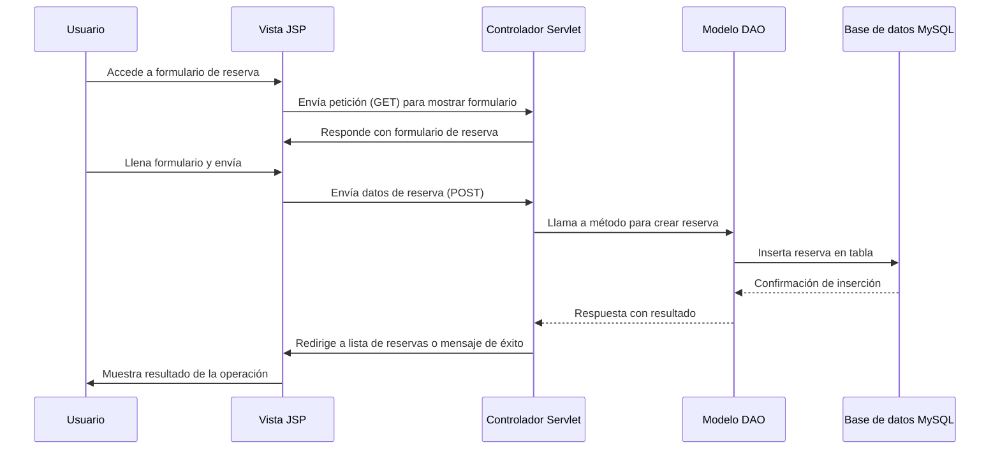

# SistemaReservas

Sistema de gestión de reservas para restaurantes o establecimientos similares, desarrollado en Java con tecnologías Jakarta EE.

## 📖 Descripción del proyecto

El SistemaReservas es una aplicación web diseñada para facilitar la gestión de reservas, clientes, menús y ventas en un entorno de restaurante o servicio de comida. Permite a los administradores registrar clientes, gestionar reservas, consultar el menú y procesar ventas, mientras que los clientes pueden realizar reservas y ver el menú disponible.

**Objetivo principal:** Proveer una solución integral para la administración de reservas y operaciones básicas de un restaurante, mejorando la eficiencia y la experiencia del usuario.

## ✨ Funcionalidades

* **Gestión de clientes:** Registro, edición, eliminación y listado de clientes.
* **Gestión de reservas:** Creación, consulta y administración de reservas de mesas.
* **Gestión de menú:** Visualización de platos y categorización del menú.
* **Gestión de ventas:** Registro y seguimiento de ventas realizadas.
* **Autenticación y autorización:** Control de acceso mediante credenciales (implícito en los controladores).
* **Interfaz web responsiva:** Páginas JSP con CSS para una experiencia de usuario adecuada.
* **Conexión a base de datos:** Integración con MySQL para el almacenamiento persistente de datos.

## 🛠️ Tecnologías utilizadas

| Tecnología    | Versión | Uso                 |
| ------------- | ------- | ------------------- |
| Java          | 11      | Lenguaje de programación principal |
| Jakarta EE    | 10.0.0  | Framework para aplicaciones web empresariales |
| MySQL         | 8.0+    | Sistema de gestión de base de datos relacional |
| MySQL Connector/J | 9.2.0 | Driver JDBC para conectar con MySQL |
| Jakarta Servlet | 6.1.0  | Manejo de peticiones y respuestas HTTP |
| Jakarta JSTL  | 2.0.0   | Biblioteca de etiquetas para JSP |
| Jersey        | 2.35    | Implementación de JAX-RS para servicios REST |
| Apache Maven  | 3.8.1   | Herramienta de construcción y gestión de dependencias |
| Apache NetBeans IDE | 25  | Entorno de desarrollo integrado utilizado |

## 🏗️ Arquitectura del proyecto

El proyecto sigue una arquitectura **MVC (Modelo-Vista-Controlador)** adaptada para aplicaciones web:

* **Modelo:** Clases Java que representan las entidades del negocio (Cliente, Reserva, Menu, Plato, Mesa, Usuario, Venta) y sus respectivos DAOs (Data Access Object) para interactuar con la base de datos.
* **Vista:** Páginas JSP ubicadas en `src/main/webapp` y subdirectorios, que presentan la información al usuario y reciben sus acciones a través de formularios.
* **Controlador:** Servlets que procesan las peticiones HTTP, invocan las operaciones del modelo y dirigiran el flujo a las vistas apropiadas.

El flujo típico es:
1. El usuario interactúa con la vista (JSP).
2. La vista envía una petición HTTP al controlador (Servlet) correspondiente.
3. El controlador procesa la petición, utiliza el DAO para acceder a la base de datos y prepara los datos para la vista.
4. El controlador redirige o reenvía a una vista JSP para mostrar el resultado.



## 📂 Estructura del proyecto

```text
SistemaReservas/
├── src/
│   ├── main/
│   │   ├── java/
│   │   │   └── com/edu/pe/
│   │   │       ├── config/          # Configuración de conexión a BD
│   │   │       ├── controlador/     # Servlets (Controladores MVC)
│   │   │       ├── modelo/          # Clases entidad (Modelo)
│   │   │       └── modelo/dao/      # Clases DAO para acceso a datos
│   │   ├── resources/
│   │   │   └── META-INF/persistence.xml  # Configuración de persistencia (vacía)
│   │   └── webapp/
│   │       ├── admin.jsp
│   │       ├── cliente/             # Vistas específicas para clientes
│   │   │       ├── css/             # Hojas de estilo
│   │   │       └── vista/           # Páginas JSP de cliente
│   │       └── WEB-INF/
│   │           ├── web.xml          # Configuración de la aplicación web
│   │           └── beans.xml        # Configuración de CDA
│   └── test/                        # Directorio de pruebas (vacio)
├── target/                          # Directorio de compilación (generado por Maven)
├── pom.xml                          # Configuración de Maven
├── README.md                        # Este archivo
└── nb-configuration.xml             # Configuración de NetBeans
```

### Función de las carpetas importantes:

* `src/main/java`: Contiene todo el código fuente Java de la aplicación.
* `src/main/webapp`: Contiene los recursos web (JSP, CSS, imágenes) y la configuración de despliegue (WEB-INF).
* `src/main/resources`: Archivos de configuración no compilados (como persistence.xml).
* `pom.xml`: Archivo de configuración de Maven que define dependencias, plugins y propiedades del build.

## 🗄️ Base de datos

El proyecto utiliza una base de datos MySQL llamada **`sistema`**. Aunque no se proporcionaron scripts SQL, se pueden inferir las siguientes tablas a partir de las clases DAO y entidad:

* `cliente`: Almacena información de los clientes (id_cliente, nombre, apellido, correo, telefono).
* `reserva`: Registra las reservas realizadas (presumiblemente id_reserva, id_cliente, fecha, hora, id_mesa, etc.).
* `menu`: Información sobre el menú disponible.
* `plato`: Detalles de los platos disponibles (id_plato, nombre, descripcion, precio, etc.).
* `mesa`: Información de las mesas del establecimiento (id_mesa, numero, capacidad, estado, etc.).
* `venta`: Registro de las ventas realizadas (id_venta, fecha, total, etc.).
* `usuario`: Credenciales de acceso para los usuarios del sistema (si aplica).

Las relaciones principales incluyen:
* Un cliente puede tener múltiples reservas (1:N).
* Una reserva está asociada a una mesa y un cliente (N:1 con mesa, N:1 con cliente).
* Una venta puede estar asociada a un cliente y múltiples platos (requiere tabla intermedia no evidenciada).

**Configuración de conexión:** Se encuentra en `src/main/java/com/edu/pe/config/Conexion.java` con los siguientes valores (ejemplo, no usar en producción):

```java
public static final String username = "root"; 
public static final String password = ""; 
public static final String database = "sistema"; 
public static final String url = "jdbc:mysql://localhost:3306/"+database;
```

> **Nota:** Para deploy en producción, se recomienda externalizar estas credenciales a un archivo de configuración o variables de entorno.

## ⚙️ Requisitos previos

* **Sistema operativo:** Windows, Linux o macOS (compatible con Java 11).
* **Java Development Kit (JDK):** Versión 11 o superior.
* **Servidor de aplicaciones:** Apache Tomcat 10.0+ (compatible con Jakarta EE 10) o equivalente.
* **Base de datos:** MySQL Server 8.0+.
* **Herramienta de construcción:** Apache Maven 3.6+.
* **Navegador web:** Para acceder a la interfaz de usuario.

## 🚀 Instalación y configuración

1. **Clonar el repositorio** (o copiar los archivos del proyecto) en un directorio local.
2. **Configurar la base de datos:**
   * Crear una base de datos llamada `sistema` en MySQL.
   * Ejecutar los scripts SQL necesarios para crear las tablas (no proporcionados en el proyecto, deben crearse manualmente basado en las entidades).
   * Opcional: Poblar con datos de prueba.
3. **Verificar la configuración de conexión:**
   * Abrir `src/main/java/com/edu/pe/config/Conexion.java`.
   * Ajustar los valores de `username`, `password` y `url` si su entorno MySQL requiere credenciales diferentes o si la base de datos está en otro host/puerto.
4. **Compilar el proyecto:**
   * Abrir una terminal en el directorio raíz del proyecto.
   * Ejecutar: `mvn clean install`
   * Esto generará el archivo `SistemaReservas-1.0-SNAPSHOT.war` en el directorio `target/`.
5. **Desplegar en el servidor:**
   * Copiar el archivo `.war` generado al directorio `webapps` de su servidor Tomcat.
   * Iniciar (o reiniciar) el servidor Tomcat.
6. **Acceder a la aplicación:**
   * Abrir un navegador y visitar: `http://localhost:8080/SistemaReservas-1.0-SNAPSHOT`
   * La aplicación debería cargar la página de inicio (probablemente `admin.jsp` o una vista de cliente).

## ▶️ Ejecución del proyecto

Una vez deployada la aplicación en Tomcat:

* **URL de acceso:** `http://localhost:8080/SistemaReservas-1.0-SNAPSHOT`
* **Puerto utilizado:** 8080 (por defecto de Tomcat, configurable en `server.xml`).
* **Primer acceso:** La aplicación redirigirá a una página de inicio desde donde se puede navegar a las diferentes funcionalidades (clientes, reservas, menú, ventas).
* **Credenciales de prueba:** No se encontraron credenciales predefinidas en el código. Se recomienda registrar un usuario mediante la funcionalidad de gestión de usuarios (si está implementada) o insertar directamente en la tabla `usuario` de la base de datos.

## 🔐 Variables de entorno y configuración

El proyecto actualmente tiene las credenciales de la base de datos hardcodeadas en `Conexion.java`. Para mejorar la seguridad y flexibilidad, se debería externalizar esta configuración. Un ejemplo de cómo podría quedar un archivo `.env` (no incluido en el proyecto):

```env
DB_HOST=localhost
DB_PORT=3306
DB_NAME=sistema
DB_USER=root
DB_PASSWORD=tu_password_seguro
```

Luego, modificar `Conexion.java` para leer estas variables de entorno usando `System.getenv()` o un archivo de propiedades.

## 🧪 Pruebas

No se encontraron pruebas automatizadas (unitarias o de integración) en el proyecto. El directorio `src/test/java` está vacío o no existe. Se recomienda implementar pruebas utilizando frameworks como JUnit y Mockito para asegurar la calidad del código.

## 📊 Tiempo de desarrollo

Como no se dispone de un historial de commits preciso, se proporciona una estimación aproximada basada en la complejidad del proyecto:

| Etapa                    | Tiempo estimado |
| ------------------------ | --------------: |
| Análisis y planification |         8 horas |
| Diseño de base de datos  |         6 horas |
| Desarrollo backend       |        20 horas |
| Desarrollo frontend      |        15 horas |
| Integración y pruebas    |        10 horas |
| Documentación            |         4 horas |
| **Total**                |     **63 horas** |

> **Nota:** Esta es una estimación razonable para un desarrollador individual con experiencia básica en Java web. El tiempo real puede variar significativamente.

## 👨‍💻 Rol y contribuciones

No hay información disponible en el proyecto sobre otros contribuyentes o roles específicos. El desarrollo parece haber sido realizado por un único desarrollador (posiblemente el usuario del sistema).

## 🔄 Flujo general del sistema

A continuación, se describe el flujo típico para realizar una reserva:



## 📸 Capturas de pantalla

No se encontraron capturas de pantalla dentro del repositorio del proyecto. Se recomienda agregarlas en el futuro para demostrar la interfaz de usuario.

## 🔮 Mejoras futuras

* **Mejoras funcionales:**
  * Implementar autenticación y autorización robusta (roles: administrador, mesero, cliente).
  * Añadir generación de reportes de ventas y ocupación.
  * Integrar notificaciones por correo o SMS para recordatorios de reserva.
  * Permitir cancelación y modificación de reservas en línea.
  * Añadir gestión de inventario de insumos.
* **Mejoras técnicas:**
  * Migrar a un framework MVC moderno como Spring Boot o Jakarta Faces.
  * Externalizar la configuración de conexión a un archivo de propiedades o variables de entorno.
  * Implementar capa de servicio para separar lógica de negocio del acceso a datos.
  * Utilizar un pool de conexiones (como HikariCP) en lugar de crear conexiones por cada operación.
  * Añade manejo centralizado de excepciones y logging estructurado.
  * Escribir pruebas unitarias y de integración.
* **Seguridad:**
  * Encriptar contraseñas en la base de datos.
  * Implementar protección contra CSRF y XSS.
  * Usar prepared statements para evitar inyección SQL (ya se usa, pero revisar coverage).
  * Implementar HTTPS en producción.
* **Rendimiento:**
  * Implementar caché para datos estáticos como el menú.
  * Optimizar consultas SQL y añadir índices en la base de datos.
  * Usar compresión GZIP en las respuestas HTTP.
* **Experiencia de usuario:**
  * Diseñar una interfaz más moderna y responsive con Bootstrap o similaire.
  * Añadir validación de formularios tanto en cliente como en servidor.
  * Mejorar la accesibilidad (WCAG).
* **Escalabilidad:**
  * Diseñar la aplicación para ser desplegada en contenedores (Docker).
  * Preparar para escalado horizontal usando balanceo de carga.

## 👥 Equipo de desarrollo

* **Desarrollador principal:** No especificado en el proyecto.
* **Roles:** Análisis, diseño, desarrollo, pruebas y documentación realizadas por un único individuo (inferido).

## 📄 Licencia

No se especificó una licencia en el proyecto. Actualmente, el código se encuentra bajo derechos de reserva estándar. Se recomienda elegir una licencia abierta (como MIT o Apache 2.0) si se planea distribuir o colaborar públicamente.

---

## Resumen técnico

Se desarrolló un sistema web de gestión de reservas para restaurantes usando Java 11 y Jakarta EE 10.0.0, con MySQL como base de datos. La arquitectura sigue el patrón MVC utilizando Servlets como controladores y JSP para la vista. El tiempo estimado de desarrollo es de aproximadamente 63 horas. El proyecto está en un estado funcional básico, requiriendo mejoras en seguridad, configuración y pruebas para ser considerado listo para producción.